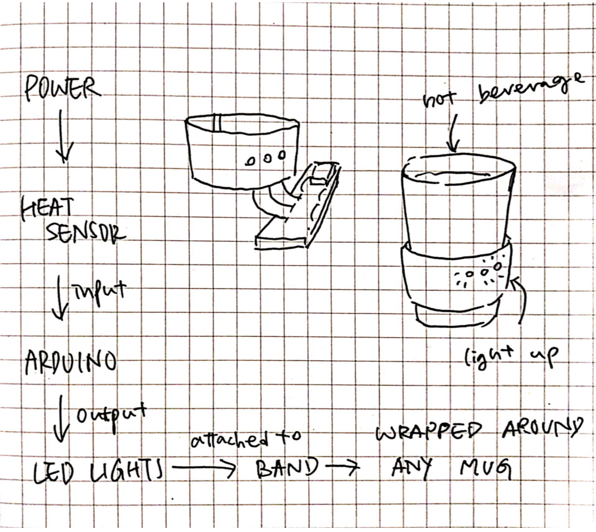

# Final Project: SAFE MUG
A mug that has a heat sensor and LED lights connected to it for the user to tell how hot their drink is without touching the mug.
## Summary
As a person who enjoys making and drinking hot tea, I sometimes get my mouth and hands burnt by the boiling hot water inside my mug because sometimes it is difficult to tell how hot the tea is without touching it first. In order to prevent that from happening in the future, I am planning to make a temperature detector for my mug that tells me how hot my drink is.
The detector will have a heat sensor and 3 LED lights connected to it - depending on how high the temperature is, a number of lights will be turned and off. For example, if the temperature is above 80 °C, all 3 lights will be turned on. If the temperature drops to 60 to 80 °C, 2 lights will be on. If the temperature is 30 - 60 °C, 1 light will be turned on. If the temperature is below 30 °C, all lights will be turned off.
The detector is going to be a detachable device that wraps around the mug, so it can be used on all types of mugs and glasses.

## Component Parts
Hardware:
* Mug
* Heat sensor
* LED lights
* On/Off switch
* Materials for the band Software:
* Arduino program 

## Block Diagram

## Challenges
The hardest part is going to be incorporating the heat sensor in my program, since I have never done it.

## Timeline
What parts of the project do you anticipate you will complete in each of the next 5 weeks? Your goal is to solve the scary problems as quickly as possible!
* Week 1: Write proposal
* Week 2: Get materials and write program
* Week 3: Test and revise program
* Week 4: make band
* Week 5: Present!
